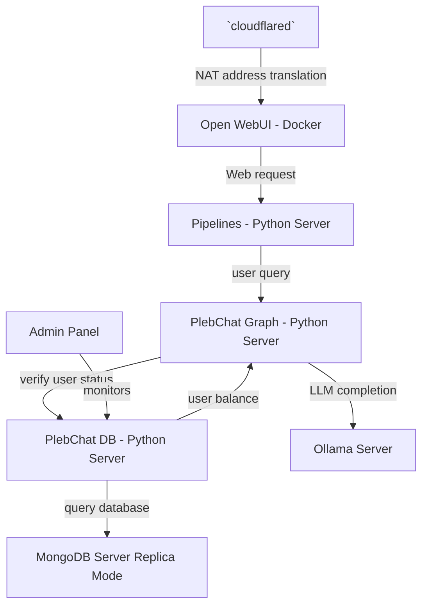

# PlebChat


## initialize

```sh
# setup .env vars first
cp .env.example .env

mkdir ./volumes/backend_data
mkdir ./volumes/pipelines_dir
```


### Production setup
```sh
docker compose -f docker-compose.yml --env-file .env up -d
```


### Development setup
```sh
docker compose -f docker-compose-dev.yml --env-file .env up -d
```


## check logs

https://containrrr.dev/watchtower/arguments/

```sh
docker logs watchtower
```

---

## System Overview / Architecture Diagram



## Open WebUI

See [website](https://openwebui.com), [repository](https://github.com/open-webui/open-webui), [documentation](https://docs.openwebui.com) and [Setup instructions](./setup_oi.md)

This is an open-source repository used as the "frontend."

## pipeline

See [repository](https://github.com/PlebeiusGaragicus/PlebChatPipe) and [setup instructions](./setup_pipeline.md)

Think of Open WebUI pipelines as extensions.  This repository stands up an OpenAI-compatible API that is used to invoke our LangGraph server.

## LangGraph agent

See [repository](https://github.com/PlebeiusGaragicus/PlebChatGraph) and [setup instructions](./setup_langgraph.md)

This is our LangGraph agent.

## User database

See [respository](https://github.com/PlebeiusGaragicus/PlebChatDB) and [setup instructions](./setup_db)

This database tracks token balances and usage history of registered users.

This includes a FastAPI server which communicates with a MongoDB database in replication mode.

An admin panel written with Streamlit allows for local maintenance.
